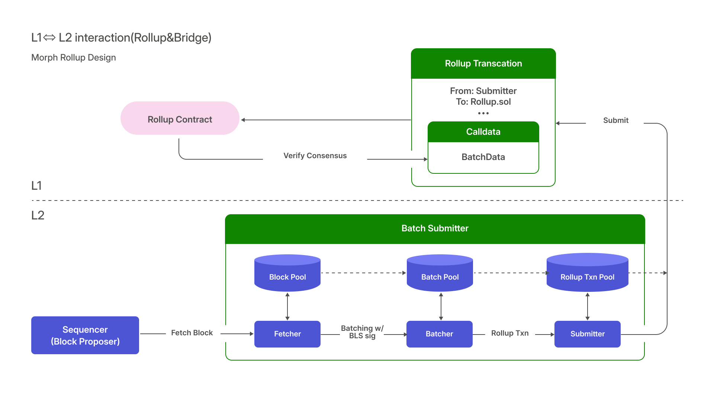

:::tip

 This overview offers a concise introduction to Morph’s rollup technology stack. For an in-depth understanding, please refer to the "How Morph Works" section of our documentation.

:::

## The Modular Approach in Layer 2

Traditionally, the concept of modularity has been applied to Layer 1 blockchains, segmenting them into distinct layers. At Morph, we've extended this modular philosophy to Layer 2, building our platform around this principle.

In a typical Layer 1 blockchain, the architecture consists of four major layers:
- Consensus: The mechanism through which network agreement is achieved.
- Execution: Where transaction processing and smart contract operations occur.
- Settlement: The process of finalizing transactions.
- Data Availability: Ensuring that necessary information is accessible for validation.

In the context of Layer 2, Morph reinterprets these layers with unique functionalities:

- **Consensus and Execution via Decentralized Sequencer Network**: At Morph, these functions are integrated and handled by our decentralized sequencer network. Sequencers orchestrate, process, and achieve consensus on Layer 2 transactions, forming the primary interface for user interactions.

- **Settlement with Optimistic zkEVM**: Settlement in Morph refers to the finalization of Layer 2 transactions at the Ethereum level. It involves the crucial step of validating Layer 2 states. Morph employs the optimistic zkEVM for this purpose, a hybrid approach blending the best of optimistic rollups and zk-rollups. Layer 2 states will be eventually finalized by a significantly shorter challenge period or if gets challenged, a corresponding zk-proof.

- **Data Availability through 'Rollup' Process**: This entails transferring essential Layer 2 data to Ethereum. In Morph, this is achieved through the 'Rollup' process, where a batch submitter compiles blocks into batches and submits them as Layer 1 transactions on Ethereum.

## Independent yet Collaborative Functions
Each of these major functions operates independently, facilitating asynchronous tasks and switchable implementations:
1. Sequencer Network: Executes Layer 2 transactions and updates local state.
2. Rollup Module: Transforms Layer 2 blocks into batches for submission to Layer 1.
3. State Verification: Utilizes Layer 1 security to verify Layer 2 states under the optimistic zkEVM rules. 

This modular architecture enhances flexibility, adaptability, and composability within the Morph ecosystem.

## Diverse Roles

Morph’s architecture is further defined by five pivotal roles: Sequencers, Validators, Nodes, Provers, and Layer 1 (Ethereum). Each role carries specific responsibilities and utilizes distinct components to fulfill its function, contributing to the seamless operation of the network.

For a deeper understanding of Morph’s architecture, please visit our comprehensive [Developer Docs](../build-on-morph/0-developer-navigation-page.md)

