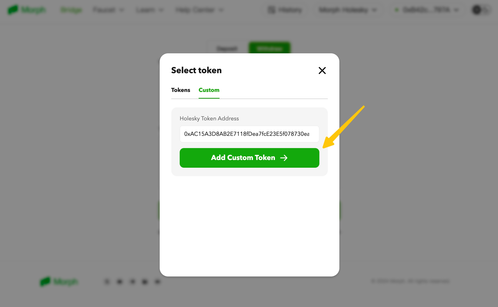
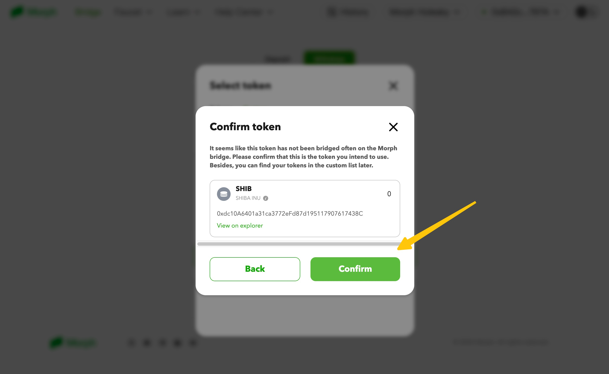
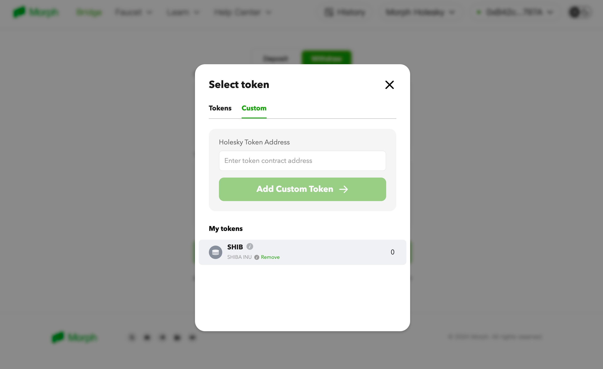

Please first review our documentation on [Communication Between Morph and Ethereum](../../how-morph-works/general-protocol-design/2-communicate-between-morph-and-ethereum.md) for some required fundamental knowledge. 


## Deposit ETH and ERC20 Tokens from L1​

The Gateway Router allows ETH and ERC20 token bridging from L1 to L2 using the depositETH and depositERC20 functions respectively. It is a permissionless bridge deployed on L1. Notice that ERC20 tokens will have a different address on L2, you can use the getL2ERC20Address function to query the new address.

:::tip
  **`depositETH`** and **`depositERC20`** are payable functions, the amount of ETH sent to these functions will be used
  to pay for L2 fees. If the amount is not enough, the transaction will not be sent. All excess ETH will be sent back to
  the sender. `0.00001 ETH` should be more than enough to process a token deposit.
:::

When bridging ERC20 tokens, you don’t have to worry about selecting the right Gateway. This is because the `L1GatewayRouter` will choose the correct underlying entry point to send the message:

- **`L1StandardERC20Gateway`:** This Gateway permits any ERC20 deposit and will be selected as the default by the L1GatewayRouter for an ERC20 token that doesn’t need custom logic on L2. On the very first token bridging, a new token will be created on L2 that implements the MorphStandardERC20. To bridge a token, call the `depositERC20` function on the `L1GatewayRouter`.

<!---->
<!--
- **`L1CustomERC20Gateway`:** This Gateway will be selected by the `L1GatewayRouter` for tokens with custom logic. For an L1/L2 token pair to work on the Morph Custom ERC20 Bridge, the L2 token contract has to implement `IMorphStandardERC20`. Additionally, the token should grant `mint` or `burn` capability to the `L2CustomERC20Gateway`. 
-->

All Gateway contracts will form the message and send it to the `L1CrossDomainMessenger` which can send arbitrary messages to L2. The `L1CrossDomainMessenger` passes the message to the `L1MessageQueueWithGasPriceOracle`. Any user can send messages directly to the Messenger to execute arbitrary data on L2. 

This means they can execute any function on L2 from a transaction made on L1 via the bridge. Although an application could directly pass messages to existing token contracts, the Gateway abstracts the specifics and simplifies making transfers and calls.

When a new block gets created on L1, the Sequencer will detect the message on the `L1MessageQueue`, and submit the transaction to the L2 via the its L2 node. Finally, the L2 node will pass the transaction to the `L2CrossDomainMessenger` contract for execution on L2.

## Withdraw ETH and ERC20 tokens from L2

The L2 Gateway is very similar to the L1 Gateway. We can withdraw ETH and ERC20 tokens back to L1 using the `withdrawETH` and `withdrawERC20` functions. The contract address is deployed on L2. We use the `getL1ERC20Address` to retrieve the token address on L1.

:::tip
  **`withdrawETH`** and **`withdrawERC20`** are payable functions, and the amount of ETH sent to these functions will be used to pay for L1 fees. If the amount is not enough, the transaction will not be sent. All excess ETH will be sent back to the sender. Fees will depend on L1 activity but `0.005 ETH` should be enough to process a token withdrawal.
:::

:::tip
  **Ensure transactions won’t revert on L1 while sending from L2**  There is no way to recover bridged ETH, tokens, or NFTs if your transaction reverts on L1. All assets are burned on Morph when the transaction is sent, and it's impossible to mint them again
:::

### Finalize your Withdrawal

Besides start a withdraw request on Morph, there is one additional step to do. You need to finalize your withdraw on Ethereum.

This is because of Morph's optimistic zkEVM design, you can read the details [here](../../how-morph-works/general-protocol-design/2-communicate-between-morph-and-ethereum.md): 


To do this, First you need to make sure:

- The batch containing the withdraw transactions has passed the challenge period and is marked as finalized (meaning in the `Rollup`contract, **withdrawalRoots[batchDataStore[_batchIndex].withdrawalRoot] = true**)

Once confirmed, you can call our backend services interface:

`/getProof?nonce=withdraw.index`

to obtain all the information you need to finalize your withdraw, which include:

- Index: The position of the withdrawal transaction in the withdraw tree, or rank of your transaction among all the L2->L1 transactions.
- Leaf: The hash value of your withdraw transaction that stored in the tree
- Proof: The merkel proof of your withdraw transaction
- Root: The withdraw tree root


, you need to use the `proveAndRelayMessage` function of the `L1CrossDomainMessenger` contract.

After obtaining the above information, the finalization of the withdraw operation can be carried out by calling `L1CrossDomainMessenger.proveAndRelayMessage()`.

The required parameters are 

```solidity
  address _from, 
  address _to, 
  uint256 _value, 
  uint256 _nonce, 
  bytes memory _message, 
  bytes32[32] calldata _withdrawalProof, 
  bytes32 _withdrawalRoot
```

`_from`,`_to`, `_value`, `_nonce`, and `_message` are the original content of the withdraw transaction, which can be obtained from the Event `SentMessage` included in the transaction initiated by the L2 layer withdraw. 

`_withdrawalProof` and `_withdrawalRoot` can be obtained from the aforementioned backend API interface.

<!--

## Creating an ERC20 token with custom logic on L2

If a token needs custom logic on L2, it will need to be bridged through an `L1CustomERC20Gateway` and `L2CustomERC20Gateway` respectively. The custom token on L2 will need to give permission to the Gateway to mint new tokens when a deposit occurs and to burn when tokens are withdrawn

The following interface is the `IMorphStandardERC20` needed for deploying tokens compatible with the `L2CustomERC20Gateway` on L2.

```solidity
interface IMorphStandardERC20 {
  /// @notice Return the address of Gateway the token belongs to.
  function gateway() external view returns (address);

  /// @notice Return the address of counterpart token.
  function counterpart() external view returns (address);

  /// @dev ERC677 Standard, see https://github.com/ethereum/EIPs/issues/677
  /// Defi can use this method to transfer L1/L2 token to L2/L1,
  /// and deposit to L2/L1 contract in one transaction
  function transferAndCall(address receiver, uint256 amount, bytes calldata data) external returns (bool success);

  /// @notice Mint some token to recipient's account.
  /// @dev Gateway Utilities, only gateway contract can call
  /// @param _to The address of recipient.
  /// @param _amount The amount of token to mint.
  function mint(address _to, uint256 _amount) external;

  /// @notice Burn some token from account.
  /// @dev Gateway Utilities, only gateway contract can call
  /// @param _from The address of account to burn token.
  /// @param _amount The amount of token to mint.
  function burn(address _from, uint256 _amount) external;
}
```

### Adding a Custom L2 ERC20 token to the Morph Bridge

Tokens can be bridged securely and permissionlessly through Gateway contracts deployed by any developer. However, Morph also manages an ERC20 Router and a Gateway where all tokens created by the community are welcome. Being part of the Morph-managed Gateway means you won't need to deploy the Gateway contracts, and your token will appear in the Morph frontend. To be part of the Morph Gateway, you must contact the Morph team to add the token to both L1 and L2 bridge contracts. To do so, follow the instructions on the [token lists](https://github.com/Morph-tech/token-list) repository to add your new token to the official Morph frontend.

-->

:::tip Use the SDK

You can also try our SDK to interact with the bridge system by referring to our [SDK Doc](../sdk/1-globals.md)

:::
## Add your Token to the Official Bridge

Currently, our official bridge only support certain pre-defined tokens to be bridged, if you want to bridge your own tokens, you need to manually add the token, and here is how to do it.

### Add Tokens to the gateway through Morph Bridge Frontend

The easiest way to support your token is to manually add it on our [official bridge frontend](https://bridge-holesky.morphl2.io/), you can simply do it with the following steps:

1. Click the token selection button on Morph Holesky Bridge


2. Input & Confirm your desire Ethereum token contract address under the custom token section



3. Get the Layer 2 token contract address and confirm it.



4. Now it is supported and you and other users can start to bridge it! 



### Add token support to the bridge frontend

By add token to the gateway, you and other users can bridge the token by input the token address. Step further, if you want your token shows on the bridge frontend token list. You need to raise a PR to our bridge repo.

You can find how to do it in the [morph list repo](https://github.com/morph-l2/morph-list).


Keep in mind that:
- You need to add both your L1 & L2 token to the list
- The L2 token contract address is obtained by adding your tokens through Morph bridge frontend

Here is an [example PR commit](https://github.com/morph-l2/morph-list/pull/27/commits/228481db6b8d69b8f40e7369dae62722aa570eb7
) for your reference.


