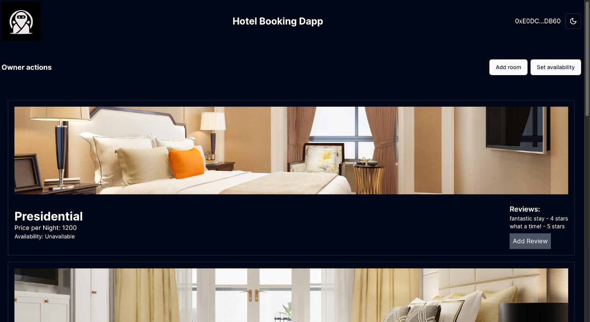
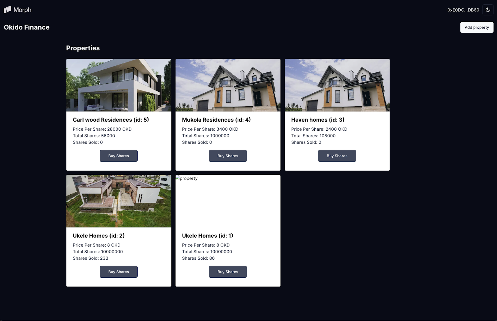

We provide multiple example Dapps for developers, built on our [Morph starter template](https://github.com/morph-l2/morph_starter_kit), deployed on the Morph Testnet, and accompanied by corresponding frontends.

These examples are very helpful for developers to go through the entire development process on Morph. Below is a brief introduction of the example Dapps and tutorial links.

:::tip Morph Starter Template

The Morph starter kit helps developers quickly and efficiently, build dApps on the Morph blockchain. It is a comprehensive template for building fullstack dApps. 

:::

## Example Dapp: Building a Decentralized Hotel Booking System on Morph

[Check the tutorial](https://morph.ghost.io/developer-guide-building-a-decentralized-hotel-booking-system-on-morph-2/)

This guide walks you through the process of building a decentralized hotel booking system on the MorphL2 blockchain using Solidity smart contracts and a React & Wagmi front-end. This system allows hotel owners to add rooms, manage room availability, accept bookings, and receive reviews from guests.

## Example Dapp: Building a fractionalized real-estate dApp

[Check the tutorial](https://morph.ghost.io/developer-guide-realestate-dapp/)

Imagine being able to invest in a high-value real estate property without needing to shell out a huge amount of money upfront. Sounds pretty appealing, right? This is the magic of fractionalization. By dividing a property into smaller, more affordable shares, fractionalization makes it possible for just about anyone to get in on the real estate action. It’s like turning a luxury mansion into a bunch of reasonably priced slices that you can buy and sell easily, just like stocks.

Our project today, Okido Finance, takes this idea and builds a decentralized application (DApp) around it. With Okido Finance, property owners can create shares of their real estate assets and investors can buy these shares using a custom ERC20 token. This not only democratizes real estate investment but also adds a layer of liquidity, making it easier to trade shares and get in or out of investments.

In this tutorial, I’ll walk you through building the Okido Finance DApp step by step. We’ll start with setting up the development environment, move on to deploying smart contracts, and finish with designing a user-friendly UI.

By the end, you’ll have a solid grasp of how to build a decentralized real estate fractionalization platform. Whether you’re looking to create something similar or just want to learn more about these technologies, you’ll be well-equipped to dive deeper into fractionalization. Let’s get started!